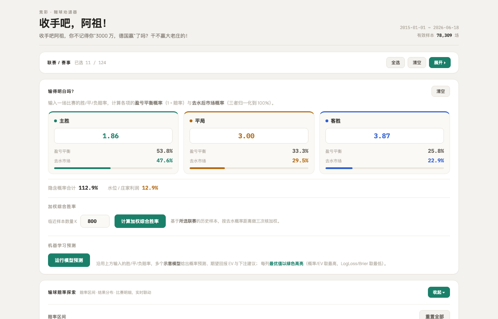
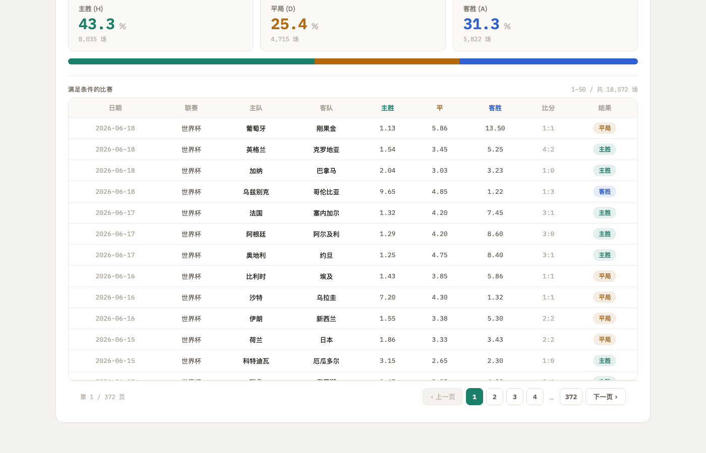

# 赌球劝退器

足球竞彩赔率分析工具。输入比赛赔率，计算去水真实概率、查询历史加权胜率、运行多模型 ML 预测，用数据劝退冲动下注。

**在线体验：** [lottery.dichen.cc](http://lottery.dichen.cc)

[English](README.md)

## 截图





## 功能

- **去水赔率计算** — 剥离庄家抽水，还原主胜/平局/客胜的真实隐含概率与期望值 (EV)
- **加权历史胜率** — Tricube 核函数加权 KNN，在选定联赛的历史比赛中找到赔率相似的场次，统计加权胜率
- **ML 模型预测** — 逻辑回归、随机森林、LightGBM、CatBoost、KNN、Inverse-LogLoss 加权集成，输出概率与 EV
- **赔率探索器** — 按联赛和赔率区间筛选历史比赛，查看分布直方图与比赛明细

## 技术栈

| 层 | 技术 |
|---|------|
| 前端 | React + Vite |
| 浏览器端数据库 | sql.js (WebAssembly SQLite) |
| ML 后端 | FastAPI + scikit-learn + LightGBM + CatBoost |

前端通过 sql.js 在浏览器内直接查询 SQLite 数据库，无需后端参与；仅 ML 预测请求发送到 Python API。

## 快速开始

### 前端

```bash
cd web
npm install
npm run dev
```

访问 `http://localhost:5173`。需要将数据库文件放到 `web/public/lottery.db`。

### ML 后端（可选）

```bash
pip install fastapi uvicorn pandas numpy scikit-learn lightgbm catboost
cd server
uvicorn main:app --reload
```

服务端加载 `model/artifacts/` 中的预训练模型（本地训练：`python model/train_models.py`）。后端未运行时，前端 ML 模块会使用本地近似值作为 fallback。

## 数据库

项目需要一个 SQLite 数据库 `lottery.db`，包含 `matches` 表：

| 字段 | 说明 |
|------|------|
| match_date | 比赛日期 |
| league_name_abbr | 联赛缩写 |
| home_team / away_team | 主/客队 |
| h / d / a | 主胜/平局/客胜赔率 |
| win_flag | 比赛结果 (H/D/A) |
| sections_no999 | 场次编号 |

数据库文件不包含在仓库中，需自行准备。

## 部署

使用 Nginx 反向代理：

```nginx
server {
    listen 443 ssl;
    server_name lottery.yourdomain.com;

    root /var/www/lottery;
    index index.html;

    location / {
        try_files $uri $uri/ /index.html;
    }

    location /api/ {
        proxy_pass http://127.0.0.1:8000/;
    }
}
```

构建前端：

```bash
cd web
npm run build
# 将 dist/ 内容和 lottery.db 复制到服务器 /var/www/lottery/
```

## 项目结构

```
├── web/            # React 前端
├── server/         # FastAPI ML 预测服务
├── model/          # 模型训练脚本
└── design/         # UI/UX 设计稿（只读参考）
```

## 打赏

如果这个项目对你有帮助，欢迎请我喝杯咖啡 :)

<a href="assets/wechat-pay.jpg"></a>

## License

MIT
